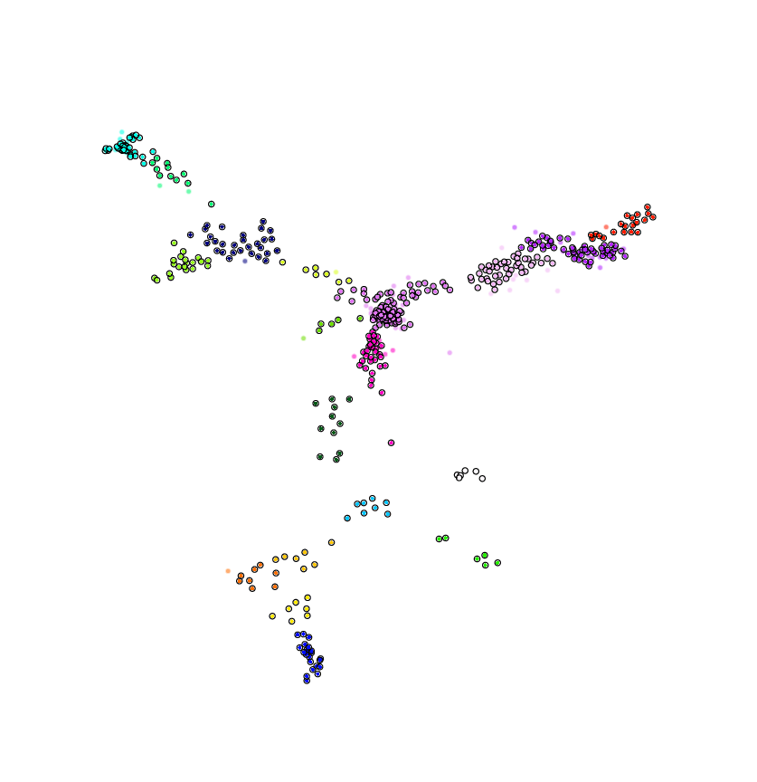
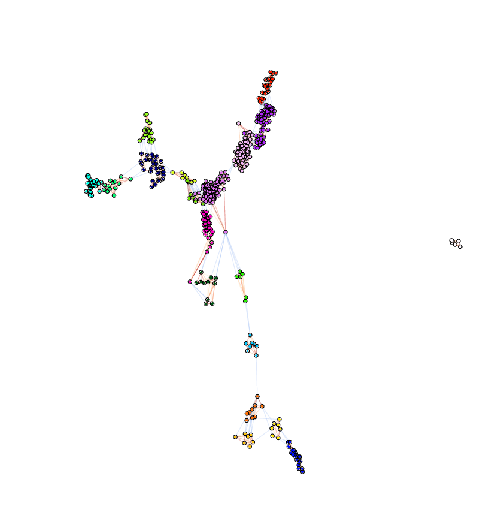
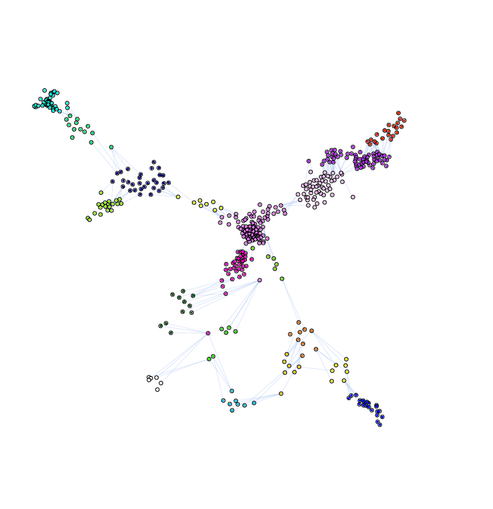
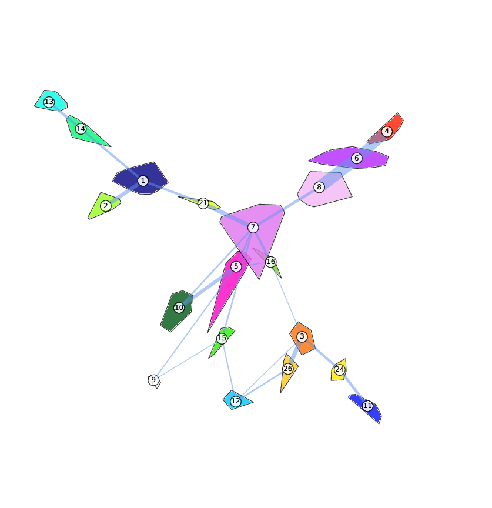
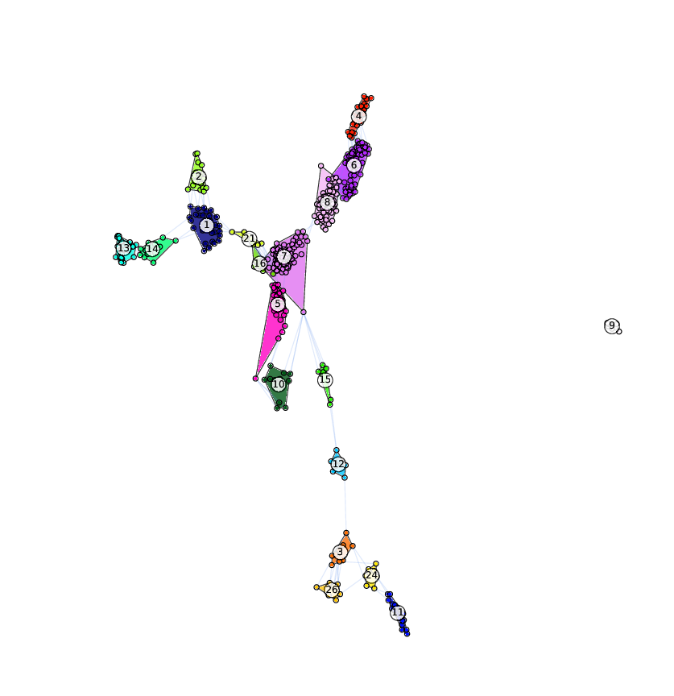

[](https://zenodo.org/badge/latestdoi/61370061)

# GraphEmbed
Compute a 2D embedding of a data matrix given supervised class information.

A discrete label for each instance is expected.
A graph is built where nodes are instances and there exist two types
of edges: the 'knn' edges and the 'k_shift' edges.
A knn edge is an edge to the k-th nearest instance that has the same
label.
A k_shift edge is an edge to the k-th nearest instance that is denser
and has a different label.
Density is defined as the sum of the pairwise cosine similarity between
an instance and all the other instances.
The desired edge length is the euclidean distance between the instances.
If the endpoints of an edge have the same label then the desired distance
is divided by 1 + class_confidence.
A k-shift edge is deleted if at least one of the endpoints is an
outlier.
Outlier nodes are defined as those instances that have no mutual
k neighbors.

Finally the embedding is computed as the 2D coordinates of the
corresponding graph embedding using the force layout algorithm from
Tomihisa Kamada, and Satoru Kawai. "An algorithm for drawing general
undirected graphs.", Information processing letters 31, no. 1 (1989): 7-15.

<p align="center"></p>

Here is a link to the [interactive jupyter notebook](https://github.com/fabriziocosta/GraphEmbed/blob/master/interactive_graph_layout.ipynb) (needs to be run locally).

## Installation

GraphEmbed can be installed via PyPI:

```bash
# a non pip dependency is graphviz, you can install this e.g. via 
conda install pygraphviz
```

```bash
pip install graphembed
```

A python2 version of GraphEmbed can be installed via [conda](http://conda.pydata.org/miniconda.html):

```bash
conda install graph_embed -c bioconda
```

## Usage

You can execute the program by typing:

```./graph_embed.py -i example/prot_expression.csv -t example/target.csv```

You can change the strength of the belief in the supervised information. Values higher than 0 indicate a stronger belief and will result in more compact layouts for instances of the same class. Values of 0.5-1 are suitable for clean data where clusters are naturally well separated, values of 5-30 are suitable for noisy data where it is necessary to force a strong separation in the 2D representation. 

To set a desired separation strength use -c, to specify the number of neighbors use -k:

```./graph_embed -i example/prot_expression.csv -t example/target.csv -c 1.5 -k 5 -z 10 -l 0 --random_state 2 --normalization --correlation_transformation --feature_selection```


## Output

The option -o allows to set a directory where the produced files are placed.
The directory name is suffixed with a time stamp that includes year-month-day-hour-min-sec.
The following files are produced:

```
2D_coords.txt       The 2D coordinates, one line per instance
target.txt          The target identifier, one line per instance 
img_1_clean.pdf     The image of the 2D embedding.
img_2_edges.pdf     The image of the 2D embedding with lines in red for knn edges and lines in blue for k-shift-edges.
img_3_edge.pdf      The image of the 2D embedding with lines in blue for the first shift-edges.
img_4_hull.pdf      The image of the 2D embedding with class convex hulls and edges proportional to the num of first shift-edges across classes.
img_5_hull_link.pdf The image of the 2D embedding with class convex hulls and first shift-edges.
log                 The program execution log file
```

## Help

```
Version: 2.4
Author: Fabrizio Costa [costa@informatik.uni-freiburg.de]

Usage:
  graph_embed.py -i <file> -t <file> [-o NAME]
              [-c N, --class_confidence=N] [-k N] [-d N] [-z N] [-l N]
              [--correlation_transformation] [--normalization]
              [--feature_selection]
              [--min_threshold=N] [--max_threshold=N] [--random_state=N]
              [--display] [--figure_size=N] [--cmap_name=NAME]
              [--verbose] [--do_not_add_timestamp]
  graph_embed (-h | --help)
  graph_embed --version

Options:
  -i <file>                         Specify input data file in CSV format.
  -t <file>                         Specify classes data file in CSV format.
  -o NAME                           Output directory name [default: out].
  -c N, --class_confidence=N        Confidence bias for clustering
                                    [default: 1.0].
  -k N                              Number of links towards closest neighbors
                                    with same class [default: 3].
  -d N                              Number of links towards denser neighbors
                                    with a different class [default: 1]
  -z N                              Number of nearest neighbors to limit the
                                    horizon where to search for denser
                                    neighbors of a different class [default: 5]
  -l N                              Number of mutual nearest neighbors that
                                    define outlier instances [default: 3]
  --normalization                   Convert data matrix to normalized matrix.
  --feature_selection               Select most discriminative features.
  --correlation_transformation      Convert data matrix to corr coeff matrix.
  --min_threshold=N                 Min num instances per class [default: 5]
  --max_threshold=N                 Max num instances per class [default: 300]
  --random_state=N                  Random seed [default: 1]
  --display                         Display graphs on terminal.
  --figure_size=N                   Figure size [default: 15].
  --cmap_name=NAME                  Color scheme [default: gist_ncar].
  --do_not_add_timestamp            Do not use timestamp as suffix for
                                    output directory name.
  -h --help                         Show this screen.
  --version                         Show version.
  --verbose                         Print more text.

  ```
  
## Sample output pdf files

The image of the 2D embedding.
<p align="center"></p>

The image of the 2D embedding with lines in red for knn edges and lines in blue for k-shift-edges.
<p align="center"></p>

The image of the 2D embedding with lines in blue for the first shift-edges.
<p align="center"></p>

The image of the 2D embedding with class convex hulls and edges with thickness proportional to the number of shift-edges across classes (effectively, num - 1 to account for potential random single link).
<p align="center"></p>

The image of the 2D embedding with class convex hulls and edges  in blue for the first shift-edges..
<p align="center"></p>

