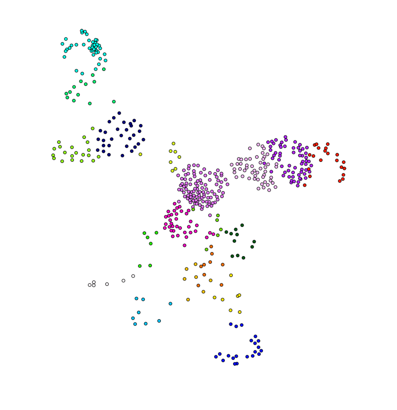
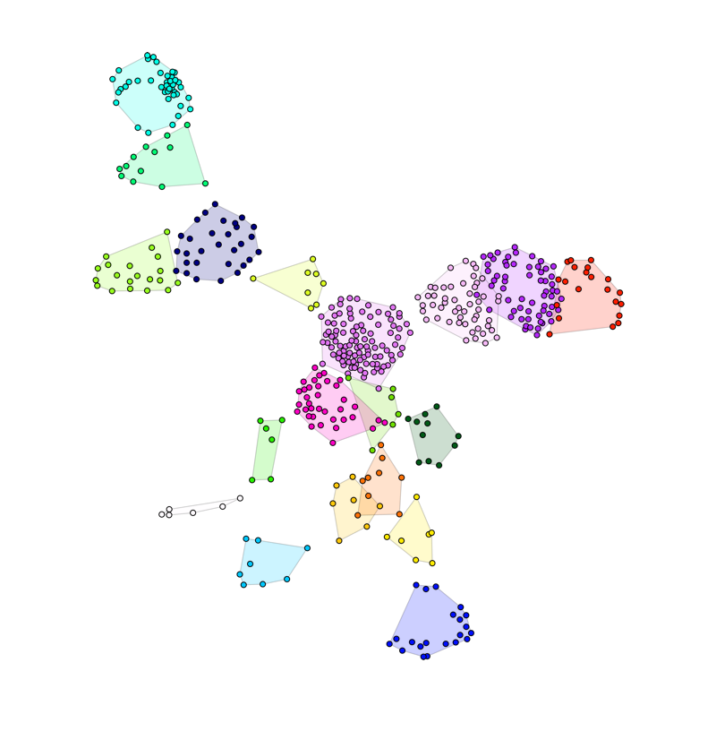
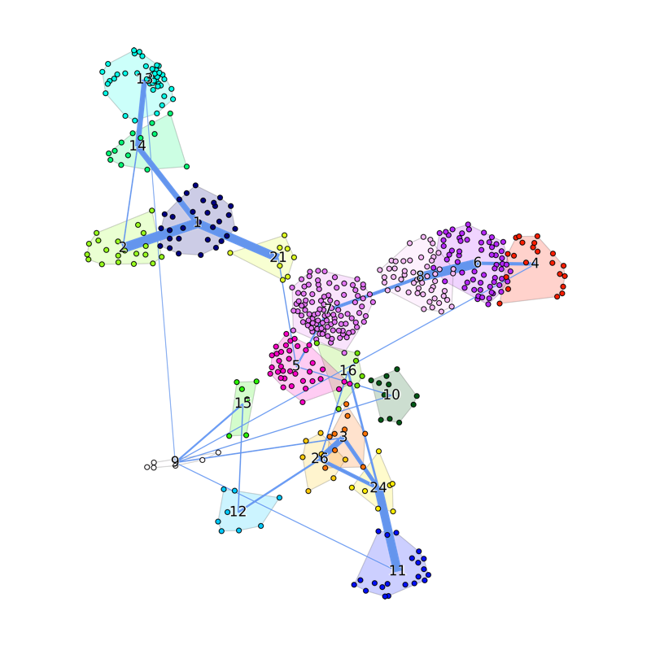
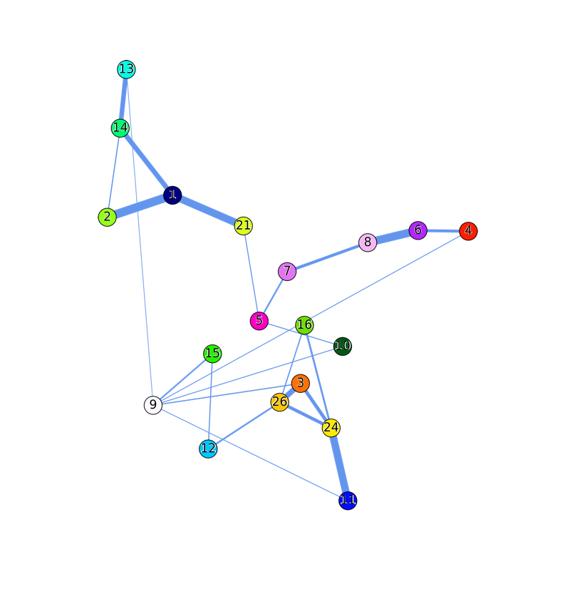

# GraphEmbed
Compute a 2D embedding of a data matrix given supervised class information.

Instances are materialized as nodes in a graph where edges connect the
nearest neighbors. Additional invisible nodes are placed to represent the
supervised classes and instances are linked to their respective classes.
The final embedding is obtained using the spring layout algorithm presented in:
Tomihisa Kamada, and Satoru Kawai. "An algorithm for drawing general
undirected graphs." Information processing letters 31, no. 1 (1989): 7-15.

<p align="center"></p>

## Installation

GraphEmbed can be installed via [conda](http://conda.pydata.org/miniconda.html):

```bash
conda install graph_embed -c bioconda
```

## Usage

You can execute the program by typing:

```./graph_embed -i data.csv -t target.csv --correlation_transformation```

If you want the program to cluster data on its own rather than relying on external information about the classes you need to specify the number of desired classes:

```./graph_embed -i data.csv -n 7 ```

You can change the strength of the belief in the clusters. Values closer to 1 (e.g. 0.9 or 0.95) indicate a stronger belief and will result in more compact layouts.

```./graph_embed -i data.csv -t target.csv --correlation_transformation --true_class_bias .95 --multi_class_bias .8```


## Output

The following files are produced:

```
fname_2D_coords.txt      The 2D coordinates, one line per instance
fname_target.txt         The target identifier (given or predicted), one line per instance 
fname_probs.txt          The probability of each instance to belong to one of the targets, one line per instance.

fname_1_clean.pdf        The image of the 2D embedding.
fname_2_clean_hull.pdf   The image of the 2D embedding with convex hulls.
fname_3.pdf              The image of the 2D embedding with convex hulls and target info.
fname_4_target.pdf       The image of the 2D embeddingof the targets.
```

## Help

```
Version: 1.0
Author: Fabrizio Costa [costa@informatik.uni-freiburg.de]

Usage:
  graph_embed -i FILE (-t FILE | -n N)  [-o NAME] [--cmap_name=NAME]
              [(-m N | --min_threshold=N)] [--multi_class_threshold=N]
              [--multi_class_bias=N] [--true_class_threshold=N]
              [--true_class_bias=N] [--nearest_neighbors_threshold=N]
              [--correlation_transformation]
              [--display] [--verbose]
  graph_embed (-h | --help)
  graph_embed --version

Options:
  -i FILE                           Specify input data file.
  -t FILE                           Specify target data file.
  -n N                              Specify the num of classes [default: 1].
  -o NAME                           Prefix for output files [default: out].
  --display                         Display graphs.
  -m N, --min_threshold=N           Min num of elements per class [default: 5].
  --cmap_name=NAME                  Color scheme [default: gist_ncar].
  --correlation_transformation      Convert data matrix to corr coeff matrix.
  --nearest_neighbors_threshold=N   Number of neighbors [default: 5].
  --true_class_bias=N               Bias for clustering [default: 0.9].
  --true_class_threshold=N          Threshold for clusters [default: 3].
  --multi_class_bias=N              Multiclass bias [default: 0].
  --multi_class_threshold=N         Multiclass threshold [default: 3].
  -h --help                         Show this screen.
  --version                         Show version.
  --verbose                         Print more text.

  ```
  
## Sample output pdf files
  
<p align="center"></p>
<p align="center"></p>
<p align="center"></p>
<p align="center"></p>

